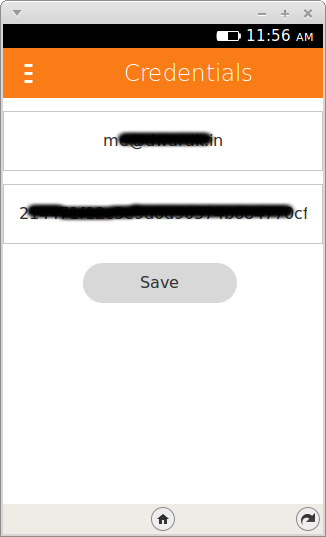

# SecretShare

> The Firefox marketplace is no longer active. This can still be used as a standard web application

## About
Firefox OS App for sharing secrets with your friends.

## Uses...
* HTML/CSS/JavaScript
* OneTimeSecret API
* IndexedDB to store the API credentials

## Screenshots

  
 
 
 

# Download
Download the app for Firefox OS from the Marketplace now - [SecretShare Page](https://marketplace.firefox.com/app/secretshare)
***
